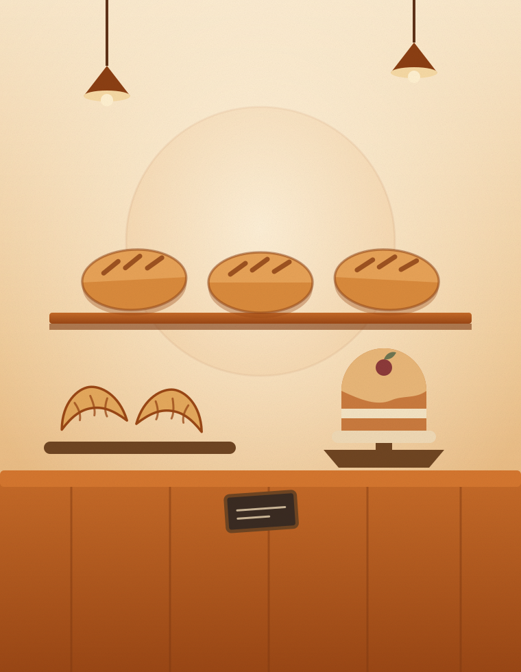

# Sweet Crumb — bakery shopfront site

A single-page site for Sweet Crumb, Pune. Plain HTML, CSS and a little JavaScript —
no build step, no frameworks, no dependencies to install. Open `index.html` and it runs.

```
index.html              the whole page
assets/css/styles.css   all styling
assets/js/main.js       reveal-on-scroll, mobile menu, "open now" badge
assets/img/*.svg        placeholder illustrations (swap these for photos)
```

---

## Before this goes live — two things to fill in

**1. The street address.** It appears in three places, each written as `[Shop no. & street]`
and `[Area], Pune [PIN]`. Search `index.html` for `[Shop` and replace all of them:

- the **Visit** section
- the **footer**
- the `application/ld+json` block in `<head>` (this is what Google reads)

**2. The Google Maps link.** The "Get directions" button currently searches for
"Sweet Crumb Bakery Pune". Once the shop has a Google Business listing, replace that
`href` with the real map link.

---

## Swapping the placeholder art for real photos

The five illustrations are stand-ins. When photos are ready, drop them into
`assets/img/` and change the `src` in `index.html`. Nothing else needs touching —
the frames crop photos automatically.

| File | Where it appears | Shoot it | Best shape |
|---|---|---|---|
| `hero-counter.svg` | Big arch, top of page | The counter or window display | Tall, 4:5 |
| `bake-loaves.svg` | "Our bakery", left arch | A loaf, close up | Tall, 4:5 |
| `bake-pastry.svg` | "Our bakery", right arch | Tray of croissants | Tall, 4:5 |
| `bake-cake.svg` | *spare — not currently used* | Mawa cake | Tall, 4:5 |
| `shop-front.svg` | "Visit" section | The shopfront from the street | Wide, 4:3 |

```html
<!-- before -->

<!-- after -->

```

Keep the `width`/`height` numbers roughly matching the real photo — it stops the page
jumping about while images load. Save photos at about 1600px on the long edge; anything
bigger just makes the page slow on phones.

---

## Editing the menu

Each menu card is a `<section class="card">` in `index.html`. One dish is one line:

```html
<li>
  <span class="list__n">Country sourdough <em>900g, 24-hour ferment</em></span>
  <span class="list__d"></span>
  <span class="list__p">₹260</span>
</li>
```

`list__n` is the name, the `<em>` inside it is the small grey description (optional),
the empty `list__d` draws the dotted line, and `list__p` is the price. Copy a line,
change the words. To remove a category, delete its whole `<section class="card">`.

**The prices and dish names are a starting point** — written to look right for a Pune
bakery. Go through and set them to the real ones.

---

## Hours

Hours are written in two places and must agree:

1. `index.html` — the hours table in the Visit section, the footer, and the
   `openingHoursSpecification` in the `<head>` block.
2. `assets/js/main.js` — `OPEN_HOUR` and `CLOSE_HOUR` at the top of section 4.
   These drive the green "Open now" badge, which is calculated in India time no
   matter where the visitor is.

The badge currently assumes the shop is open all seven days. If you ever start closing
one day a week, the table and the badge both need that exception added — message me and
I'll wire it up.

---

## The WhatsApp buttons

Every button points at `https://wa.me/919800000000` with a pre-written message. To
change the number, find and replace `919800000000` throughout `index.html`
(country code, no `+`, no spaces). The text after `?text=` is what gets typed into the
customer's chat for them — it must be URL-encoded (spaces become `%20`).

---

## Putting it online

It's static files, so hosting is free and simple. Any of these work:

- **GitHub Pages** — Settings → Pages → deploy from `main`, done in a minute.
- **Netlify / Cloudflare Pages** — drag the folder onto their dashboard.
- **Existing host** — upload the whole folder by FTP.

Then point `sweetcrumb.in` (or whichever domain) at it. Also update the
`<link rel="canonical">` and `og:image` URLs in `<head>` to the real domain once it's live.

---

## Notes on how it's built

- **Type**: Fraunces (display) and Karla (body), loaded from Google Fonts.
- **Accessibility**: keyboard-navigable, visible focus rings, a skip link, labelled
  images, and text that passes contrast checks against its background.
- **Motion**: honours `prefers-reduced-motion` — the ticker and reveals stop for
  visitors who ask their device for less animation.
- **Print**: `Ctrl/Cmd+P` gives a clean printed menu with the navigation stripped out —
  handy for a counter copy.
- **No tracking**: no analytics, no cookies, no third-party scripts beyond the font files.

### Checks

`.checks/shots.py` drives a real Chromium browser over the page at desktop and phone
sizes and fails if anything regresses: horizontal overflow, broken images, fonts not
loading, console errors, tap targets under 40px, the reveal animations getting stuck,
or the open/closed badge misbehaving.

```bash
python3 -m http.server 8760     # in this folder
python3 .checks/shots.py        # in another terminal
```

Screenshots land in `.checks/`.
